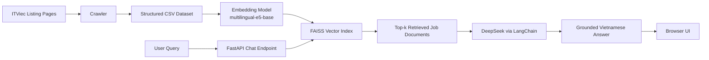
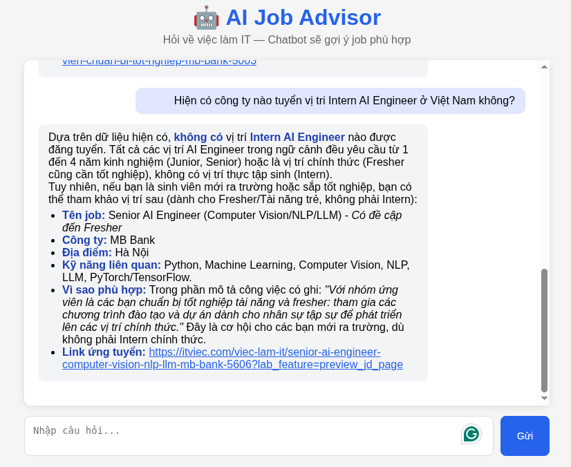
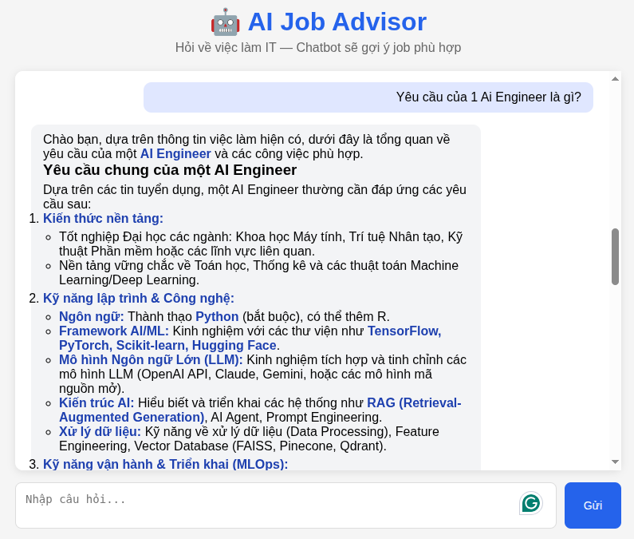

# ITViec Job AI Assistant

<p align="center">
  
</p>


<p align="center">
  
  
  
  
  
</p>

<p align="center">
  A retrieval-augmented AI job discovery assistant that crawls ITviec listings, builds a local FAISS index, and serves a lightweight chat experience for Vietnamese job search queries.
</p>

## Overview

ITViec Job AI Assistant is an end-to-end RAG application focused on AI, data, and adjacent software roles from ITviec. The project combines a web crawler, a structured dataset, multilingual embeddings, a FAISS vector index, and a FastAPI backend connected to a large language model.

The assistant is designed for questions such as:
- "AI jobs in Ha Noi"
- "What skills are commonly required for an AI Engineer?"
- "Show jobs related to LLM, RAG, or Computer Vision"
- "Which companies are hiring for machine learning roles in Vietnam?"

## What This Project Does

- Crawls targeted ITviec job categories such as `ai`, `machine-learning`, `llm`, and `data-science`
- Extracts structured fields from both listing pages and job detail pages
- Stores job data in a CSV dataset for reproducible indexing
- Builds a FAISS vector store using `intfloat/multilingual-e5-base`
- Retrieves the most relevant job postings for each query
- Uses DeepSeek through LangChain to generate Vietnamese answers grounded in retrieved job data
- Serves both an API and a simple browser-based chat interface

## Dataset Snapshot

The current repository data contains:
- `219` job records
- `155` unique companies
- Coverage across major hiring markets in Vietnam, led by `TP Hồ Chí Minh` and `Hà Nội`
- A prebuilt FAISS index stored in `db/jobs_faiss/`

## End-to-End Pipeline



## Retrieval and Answering Flow

1. The crawler collects listing metadata such as title, company, location, skills, and detail-page links.
2. Each job detail page is parsed to capture longer sections such as description, requirements, and benefits.
3. The dataset is persisted to `data/itviec_jobs.csv`.
4. `backend/build_faiss.py` converts each row into a retrieval document and builds a FAISS index.
5. The API receives a user query and retrieves the top `k=10` matching job documents.
6. The prompt combines the retrieved context with the user question.
7. DeepSeek generates a Vietnamese answer constrained to the retrieved evidence.

## Repository Structure

```text
.
├── assets/                # Demo screenshots used in project documentation
├── backend/
│   ├── api.py             # FastAPI app, retriever, and LLM response chain
│   └── build_faiss.py     # CSV-to-FAISS indexing pipeline
├── data/
│   ├── crawl/
│   │   └── crawl.py       # ITviec crawler
│   └── itviec_jobs.csv    # Structured job dataset
├── db/
│   └── jobs_faiss/        # Prebuilt FAISS index files
├── docs/
│   └── intro.md           # CV-ready short project summary
├── frontend/
│   └── index.html         # Lightweight browser chat UI
├── command.txt            # Common development commands
├── Dockerfile             # Containerized runtime
├── pyproject.toml         # Project metadata and dependencies
└── uv.lock                # Locked dependency graph for uv
```

## Tech Stack

### Application Layer
- FastAPI
- Uvicorn
- Vanilla HTML, CSS, and JavaScript

### Retrieval and LLM Layer
- LangChain
- FAISS
- Hugging Face `intfloat/multilingual-e5-base`
- DeepSeek Chat API

### Data Layer
- BeautifulSoup
- cloudscraper
- pandas
- CSV-based intermediate dataset

### Delivery Layer
- Docker
- `uv` for dependency resolution and runtime commands

## Local Development

### 1. Prerequisites

- Python `3.10+`
- `uv`
- A valid `DEEPSEEK_API_KEY`

### 2. Configure Environment

Create `.env` with:

```env
DEEPSEEK_API_KEY=your_key_here
```

### 3. Install Dependencies

```bash
uv sync
```

### 4. Crawl or Refresh the Dataset

```bash
uv run data/crawl/crawl.py
```

### 5. Rebuild the Vector Index

```bash
uv run backend/build_faiss.py
```

### 6. Start the API and UI

```bash
uv run uvicorn backend.api:app --reload
```

Open: `http://127.0.0.1:8000`

## Docker

### Build the Image

```bash
docker build -t itviec-job-ai-assistant .
```

### Run the Container

```bash
docker run --rm -p 8000:8000 --env-file .env itviec-job-ai-assistant
```

The container serves:
- API: `http://127.0.0.1:8000`
- Health check: `http://127.0.0.1:8000/health`
- Chat UI: `http://127.0.0.1:8000/`

## API Reference

### `GET /health`

Example response:

```json
{
  "status": "ok",
  "vectorstore": "loaded"
}
```

### `POST /chat`

Request:

```json
{
  "message": "Việc làm AI ở Hà Nội"
}
```

Response shape:

```json
{
  "question": "Việc làm AI ở Hà Nội",
  "answer": "...generated Vietnamese answer..."
}
```

## Prompting Strategy

The assistant is configured to:
- use only retrieved context
- avoid hallucinating jobs that are not present in the index
- respond in Vietnamese
- explain why a role is relevant
- provide a direct application link when available

## Screenshots

### Query: AI internship availability



### Query: common AI engineer requirements



## Current Limitations

- The frontend is intentionally lightweight and does not persist chat history.
- Job data freshness depends on rerunning the crawler and rebuilding the vector index.
- The quality of answers depends on the retrieval coverage of the current CSV dataset.
- The current stack targets Vietnamese responses even though the codebase and docs are now standardized in English.

## Suggested Improvements

- Add richer filtering by location, skill, company, and seniority before retrieval
- Persist structured data in PostgreSQL instead of CSV for better lineage and analytics
- Introduce scheduled crawling and index refresh jobs
- Add evaluation scripts for retrieval quality and answer grounding
- Improve the UI with streaming responses and citation cards

## Quick Commands

```bash
uv run data/crawl/crawl.py
uv run backend/build_faiss.py
uv run uvicorn backend.api:app --reload
```

## License

This repository does not currently include a license file. Add one before public redistribution if needed.
